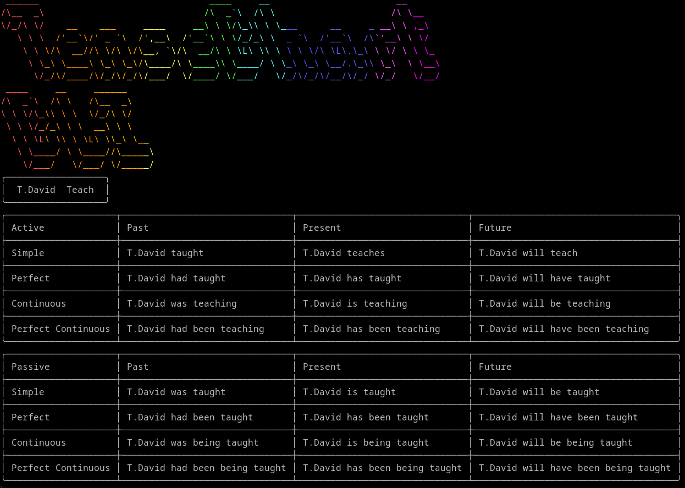
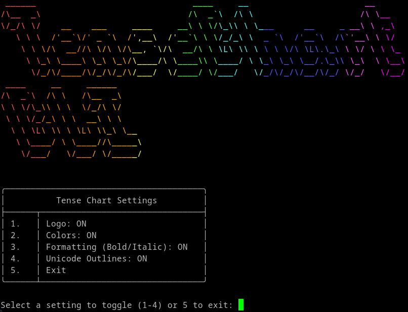

# Tense Chart CLI
The Daily Tense Charts, now in your terminal! Uses my new [Tense Chart API](https://sea.navynui.cc/tensechart/api/).


## Features

- **Daily Tense Chart**: Just like the web version, but in your terminal!
- **Custom Tense Chart**: Also like the web version
- **Random Tense Chart**: Run the command to get a new tense chart, run it again, a whole new one! NOT avalaible in the web version.


## Example images



*(`python cli.py --subject T.David --verb Teach`)*



*(`python cli.py --settings`)*


## Installation

1. Clone the repository.
2. Insure you have the following libraries installed:
    - sys (comes with python by default)
    - json (comes with python by default)
    - requests
    - argparse

    You can install them with `pip install requests argparse --break-system-packages`
    

## Usage

1. Get todays daily tense chart:
```
    python cli.py --daily
```
2. Get a random tense chart:
```
    python cli.py --random
```
3.  Get a custom tense chart:
```
    python cli.py --subject "I" --verb "run"
```
If you need any help, or forgot these commands, use the --help flag:
```
    python cli.py --help
```
## Quick note

This tool uses colors, special unicodes, and some formating for a better visual experience. If you are using a terminal that does not support these, too bad.. I will be making a way to turn these off in the future.
